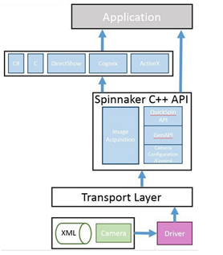
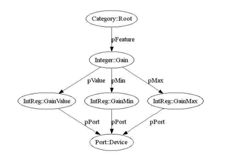
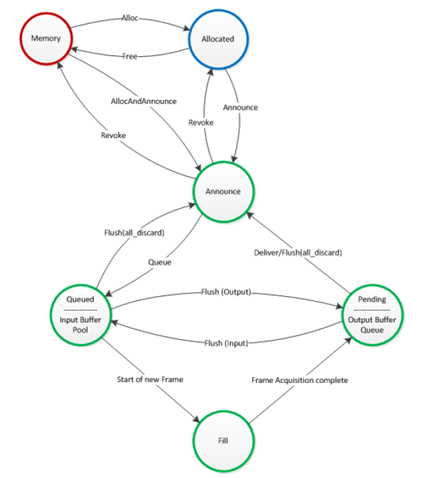
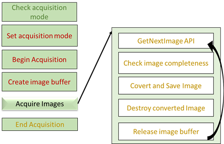

# Spinnaker API

Grasshopper’s Spinnaker SDK is an extension of GenICam API. Some spinnaker APIs are wrappers of GenICam APIs that provide easy-to-use functions. The software is divided into GenICam which is a generic interface to camera’s functionalities and GenTL which is a generic Transport Layer Interface dealing with data transfer and device communication.

Most of the camera’s parameters and functionalities can be access through the GenAPI. The GenAPI deals with the remote device which communicates with the Device Module in the GenTL architecture. The properties and commands of the remote camera and GenTL modules are structured by an entity called Nodemap. A nodemap of a remote camera or a GenTL module is a collection of network nodes which are of different types and offer different functionalities. A node of Category type can be enumerated to obtain other nodes in the nodemap. For numeric-typed nodes, getting and setting values can be done via Spinnaker APIs.

## Grasshopper functionalities
Here are the list of grasshopper’s functionalities and parameters. The grouping follows the structure of TAO camera operations as close as possible

### Basic camera initialization and finalization
A system singleton is to be created first. This node is the origin of the other nodes down the hierarchy. Then, a camera list can be obtained from the system node. We can enumerate through the list to get the ID numbers of all cameras attached to the system. From that, we can instantiate a GenICam camera handle which presents a specific camera and will be used for the rest of the operation.  When a camera is no longer in use, the camera handle and the system singleton have to be destroyed.

### Camera operations
In the first step, the camera needs initializing. After that, a camera nodemap handle has to be obtained. The nodemap handle is a gateway to camera parameters. To send a command to a camera to perform specific task such as image acquisition, there are Spinnaker APIs which takes in the camera handle and perform the task in a single command.

### Camera parameters
 To access to camera parameters, node handles have to be obtained to provide interfaces to the node values. These handles can be used to get, set, reset values of the nodes or to access to other nodes via enumerating. The list of the cameras parameters is shown in the below table.

 ### Acquisition Chain
The diagram below shows the image acquisition chain of a GenICam camera.

Spinnaker API offers simplified functions to perform image acquisition. The acquisition mode has to be set prior to acquisition. Three modes are ‘SingleFrame’, ‘MultipleFrame’, and ‘Continuous’. When acquisition begins, the camera takes images as prescribed by the acquisition mode.
- **BeginAcquisition**\
This API creates Input Buffer Pool and Output Buffer Pool, and announces buffers. The number of the buffers is 10 which can be changed. The buffers are put in the input buffer pool, ready to be filled.

- **GetNextImage**\
The first call of this API triggers the image data in the remote camera to be transferred to the buffers in the input buffer pool. When the buffers are filled, they are moved to the output buffer pool. An image handle then grabs the topmost buffer in the stack (depending on the buffer handling mode). This reduces the number of the buffers in the output buffer pool by 1. At this stage, the buffer is considered delivered.

- **ImageRelease**\
After the image data is processed (eg. converted and saved), the image handle has to release the buffer it holds back to the acquisition engine. The released buffer will be queued in the input buffer pool to be reused.

- **EndAcquisition**\
The API destroys the buffers and the buffer pools. However, the data stream is still open until the camera is de-initialized.

