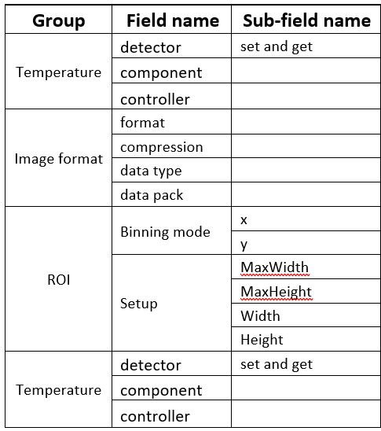
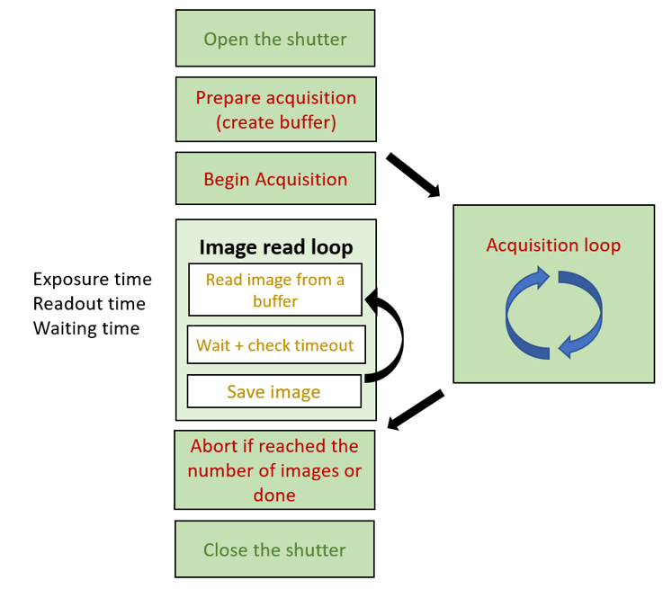

# Nuvu Camera
This page is to provide simple guide to install and work with HNu camera specific to NARIT conditions. For detialed explanation, refer to **HNu camera user manual** and **Nuvu Cameras installation guide**.

## Installtion on a Linux Mint machine
HNu128 is connected to a computer via a PCI card which talks to the frame grabber. The installation steps on Linux are explained in the **Installation Guide**, though there are some modifications to be done to make it work on Linux Mint

1. After unpack the .tgz file, we need to edit lines in the file *.osVersionbash*

* uncomment the DISTRO linux mint line
```shell
elif cat /etc/*-release | grep DISTRIB_ID | grep -i linuxmint  1>  /dev/null # TODO: ?
then # LinuxMint
 	DISTRO=ubuntu # TODO: Ubuntu-based but different release labelling, so we need to distinguish them below ... and beyond, for Pleora does not support Linux explicitly
```

* check compatible versions of Ubuntu and Linux Mint pair;  eg. Linux Mint 20.2
is based on Ubuntu Focal (Version 20.04.3). edit the version number
```shell
elif 	cat /etc/*-release | grep DISTRIB_RELEASE | grep -e "20.[[:digit:]]" 1>  /dev/null
then # release 20.something found
  OS_VERSION=$UBT_20
  ```


2. Then, run **installNuvuCameras.sh** script
```shell
 sudo ./installNuvuCameras.sh
```
3. When finished, force install edt plug in via NuvuInstaller script
```shell
sudo ./nc-install-edt.bash FORCE
```
4. Frame grabber driver needs installing. The frame grabber is of EDT, Inc.
The version that works is 5.6.0 which can be downloaded from https://edt.com/file-category/pdv/
* change the permission to run the file before running it
```shell $
chmod 0755 EDTpdv_lnx_5.6.0.0.run
```
* After installtion finished , change directory to `NuvuSW_4.2.1/NuvuInstaller/Dependencies/Third-party/EDTpdv` and copy  aconfiguration file `.cfg` to `/opt/EDTpdv/camera_config/`

5. Test if the frame grabber is working
* initialize the camera
```shell
$ sudo /opt/EDTpdv/initcam -f /opt/EDTpdv/camera_config/nc_16cl.cfg
```
* take a picture
```shell
/opt/EDTpdv/take -b /tmp/mypicture.bmp
```
6. Build the EDTpdv dynamic ibrary:
```shell
sudo make -B -C /opt/EDTpdv/CFLAGS=-fPIC libpdv.so
```

7. Remove virtual camera plug in. As of August 2021 , the virtual camera plug in is not working and has to be excluded
>The virtual plugin  has an unfortunate bug in version 4.2.1 causing the automatic detection of cameras to loop forever.
You should remove the symbolic link :
	`/opt/NuvuCameras/Plugins/nc_grab_virtual`from the `/opt/NuvuCameras/Plugins directory`.
> Alternatively, the call to `ncCamOpen()` in the examples could be modified to use
  `unit = EDT_CL`
to restrict the SDK to interrogating just the EDT framegrabber


  **note**
  *NuPixel* software has not been successfully installed on Linux. There are issues
with QT libraries.


---
## Nuvu SDK
Nuvu Camera SDK is available for. It is easy to use and straightforward. There are modules which give interfaces to the frame grabber, the camera, and in-house processing.

#### Nuvu camera functionalities
The operations of frame grabber and camera are executed through opaque handles.  Here are fundamental functionalities that the SDK offers.
Camera initialization and finalization
A camera is initialized by passing a camera handle pointer to function open. Then this handle will be used by the Nuvu APIs to execute things with the camera. When the program is finished, this handle has to be destroyed or closed.
Camera operation
Processing context setup
For each digitizer mode (CCD and EM CCD) includes two options of processing mode to improve image quality. First, the linear mode takes closed-shutter frames to be used to subtracted out from the desired images to discard artifacts. Second, the photon counting mode enhance imagery in extremely-low light conditions. It eradicates excess noise factor (ENF) as a byproduct of the electron-multiplying process. Setting up processing context is done through processing context handle.

### Camera parameters
The table below lists basic parameters of the camera.

<p align="center">



</p>

#### Temperature
The Nuvu camera has specific safety procedure regarding temperature. The camera’s CCD is cooled down when operating to a certain degree. A watchdog process that constantly checks in the CCD temperature is necessary to ensure safety of operation,

#### Gains
There are some terminologies; EM gain, analog, gain, and analog offset. The EM gain (if enabled) is applied right after electrons are produced from incident photons. The electrons are enhanced in terms of number. The enhanced electron distribution across the detector then is converted into electrical pulses before digitization. The pixilation process follows. If analog gain is enabled, the gain is applied to the entire digitized image. The analog offset comes at the last step which adds a constant to all of the pixels identically.

#### Save and Load Parameters
There functions that calls callbacks when save, write, and load processing context, camera configuration, and images.

#### Image acquisition
1.	Shutter is opened
2.	*PrepareAcquisition()*: Create image buffers and prepare the frame grabber for acquisition. This stage also determines the number of images taken and the mode of acquisition (continuous)
3.	*BeginAcquisiotion()*: Start the acquisition. The acquisition process is separated into a new thread and runs in the background
4.	Image read loop: This is a loop to read image data from image buffers. The parameters that control the sample rate are set in the previous step.
5.	*StartSaveAcquisition()*: Another method of retrieving  images is to run a separate thread to read image data from the buffers and save images in a grouped file automatically.
6.	Abort(): Abort image acquisition
7.	Shutter is closed



Go to [TAO_NARIT/src/Nuvu_example](https://github.com/Bossax/TAO_NARIT/tree/main/src/Nuvu_example) for C lang examples.
