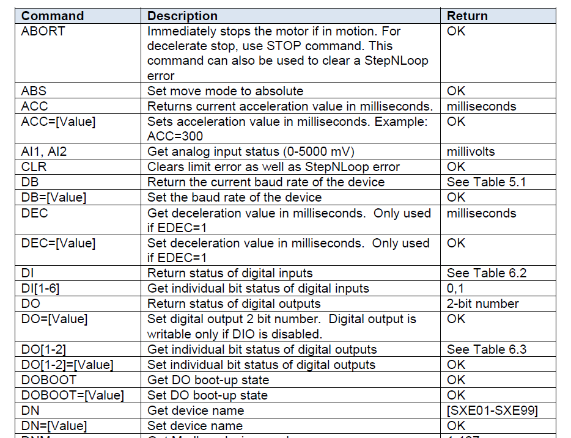

Lexitek LS-100 Rotary Stage
===
Lexitek LS-100 Rotary Stage is a motorized rotary stage equipped with a steeping motor and encoder to control the angular position of the phase plate installed in the cylindrical slot. The controller **ACE-SXE** communicate with a computer via a USB cable. To control the stepping motor, a user can use **ACE-SXE GUI** program to send ASCII commands. Here, MATLAB mex wrapper files are created to use **ACE-SXE** USB communication APIs in MATLAB environment. ACE-SXE APIs then can be called via MATLAB native functions. Example of ASCII commands is shown in the table below

<i> Table of Commands</i>

For installation, refer to **Lexitek LS-100 Rotary Stage User Manual** and **ACE-SXE Manual**

## Example
For simplicity, we choose a trapezoidal motion profile. The parameters we have to consider for the velocity profile are
1. `LSPD`: Low Speed [Pulse per second]
2. `HSPD`: High Speed [Pulse per second]
3. `ACC`: Acceleration time [milli second]

The velocity oprofile needs to be set prior to any motor motion.

Next step is to set the move mode which have
1. Incremental `INC` mode: In this mode, the motor moves to the specified number with respect to the current position
2. Absolute `ABS` mode: In this mode, the motor moves to the absolute encoder position.

To move the motor, use `X[position_value]`command to send the position to the motor. The position value is then interpreted according to the move mode set previously.

Another option to move the motor indefinitely in a specific direction is to use `JOG[+,-]` command with the plus or minus sign. This will the motor until `STOPX` command is set.

These commands are sufficient to operate LS-100 as required by the AO bench. For more complex manipulation, refer to **ACE-SXE Manual**.
